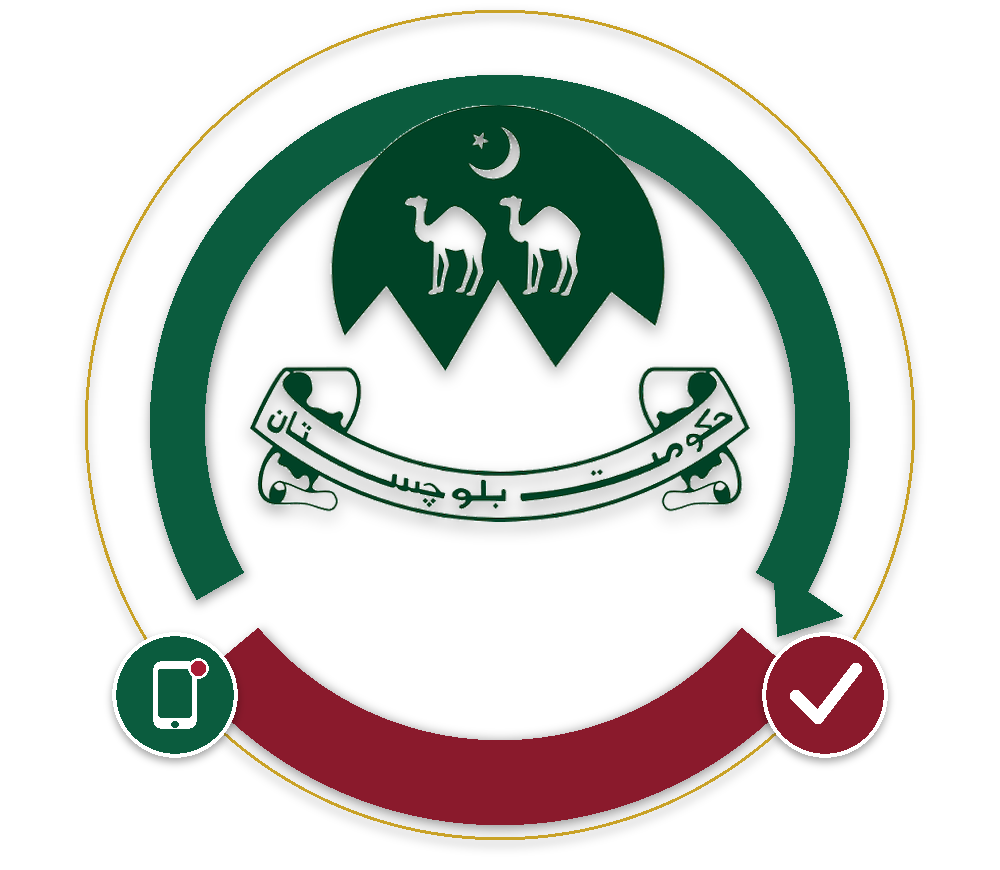
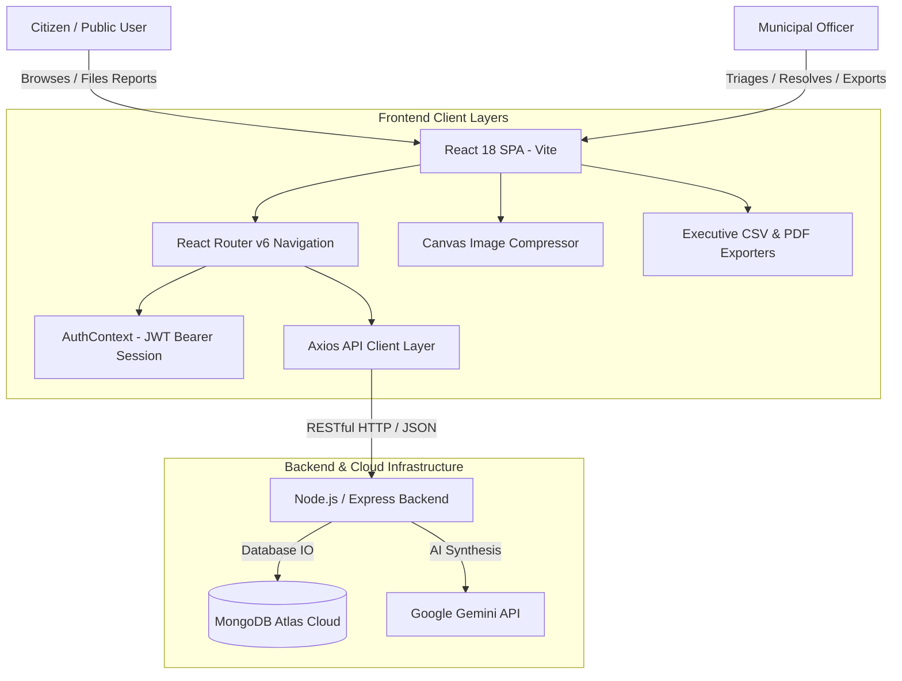

# Citizen Complaint & Municipal Operations Portal (Frontend)

<div align="center">
  
  
  <h3>Enterprise Civic Engagement & Infrastructure Incident Management Platform</h3>
  <p>Modern, responsive single-page web application empowering citizens to file municipal infrastructure complaints and enabling municipal field teams to triage, dispatch, and track repairs in real time.</p>

  [](https://reactjs.org/)
  [](https://vitejs.dev/)
  [](https://tailwindcss.com/)
  [](LICENSE)
  [](https://vercel.com)
</div>

---

## 📋 Table of Contents

- [Executive Summary](#-executive-summary)
- [Key Features & Capabilities](#-key-features--capabilities)
- [Design System & UI/UX Philosophy](#-design-system--uiux-philosophy)
- [System Architecture](#-system-architecture)
- [Project Directory Structure](#-project-directory-structure)
- [Getting Started](#-getting-started)
  - [Prerequisites](#prerequisites)
  - [Installation & Local Run](#installation--local-run)
  - [Environment Configuration](#environment-configuration)
- [Production Build & Vercel Deployment](#-production-build--vercel-deployment)
- [API Integration Specification](#-api-integration-specification)
- [Security & Performance Optimizations](#-security--performance-optimizations)
- [License](#-license)

---

## 🏛️ Executive Summary

The **Citizen Complaint & Operations Portal** bridges the communication gap between urban citizens and municipal governance. Built with modern web standards, it delivers a frictionless experience for reporting civic hazards (potholes, water pipeline leakages, uncollected solid waste, electrical outages) while equipping municipal officers with an AI-augmented triage workstation, automated dynamic priority queues, and executive audit reporting.

---

## 🚀 Key Features & Capabilities

### 🧑‍💼 For Citizens
- **Frictionless Incident Reporting**: Submit infrastructure complaints with categorized metadata, geographic sector naming, detailed descriptions, and image proofs.
- **Smart Client-Side Image Compression**: Automatic client-side canvas compression reduces high-resolution smartphone photos (3MB–10MB) to lightweight ~100–180KB JPEG payloads for instant uploading without timeouts.
- **AI Duplicate Detection & Merging**: Proactive real-time similarity matching warns citizens of duplicate reports in their sector and allows one-click upvoting of existing tickets instead of creating redundant complaints.
- **Dynamic Priority & Upvote System**: Citizen upvoting dynamically accelerates ticket visibility. Priority score formula:
  $$\text{Priority Score} = (\text{Upvotes} \times 2) + \text{Age in Days}$$
- **Anti-Spam Daily Quota**: Fair-use submission limiter (5 reports per 24 hours) with real-time remaining quota indicators.
- **Resolution Verification Loop**: When a ticket is marked resolved by field teams, citizens are prompted to evaluate the repair quality via a 1–5 star rating and feedback note.
- **Comprehensive Audit Trail**: Real-time visual timeline displaying every status transition, officer remarks, and timestamps.

### 👷 For Municipal Officers
- **Executive Operations Dashboard**: High-density triage interface with multi-faceted filtering (Category, Locality, Priority Tier, Lifecycle Status, Full-text Search).
- **AI Daily Briefing (Gemini Pro)**: Real-time natural language synthesis of operational workload, critical sector hotspots, and pending resolution SLAs.
- **Executive CSV Export**: One-click download of filtered complaint registries formatted with UTF-8 BOM encoding for complete Microsoft Excel and Apple Numbers compatibility (with seamless client-side failover).
- **Executive PDF Weekly Operations Summary**: Generates branded, styled PDF reports combining executive summaries, KPI metrics, and complaint tables using `html2canvas` and `jsPDF`.
- **Status Lifecycle Control**: Update ticket states (`Pending` → `In Progress` → `Resolved`) and log official remarks visible to the public.

---

## 🎨 Design System & UI/UX Philosophy

The frontend interface adheres to modern enterprise design principles:

- **Civic Color Palette**: Ultra-light mint-white background (`#f6faf7` / `rgb(246, 250, 247)`), crisp white surfaces (`#ffffff`), and solid emerald primary buttons (`bg-emerald-600 hover:bg-emerald-700 active:bg-emerald-800 text-white`).
- **Modern Rounded Cards & Soft Elevation**: Components use `rounded-2xl` and `rounded-3xl` cards with subtle, non-distracting shadows (`shadow-soft`: `0 2px 10px -2px rgba(0,0,0,0.03)`).
- **Responsive Unified Navigation**:
  - **Desktop Rail**: Clean vertical navigation with user profile, sign-out, and theme toggle placed in a single column.
  - **Mobile Drawer**: Slide-out drawer with `rounded-r-3xl` geometry, backdrop blur (`backdrop-blur-md`), and touch-friendly targets (`min-h-[42px]`).
- **Dual-Theme Dark Mode**: Built with soft slate-forest contrasts (`#0d1612` / `#16241e`), emerald borders, and amber highlight toggles.
- **Robust Error Resilience**: Guarded with React 18 `<ErrorBoundary>` components to prevent white-screen crashes during route changes or unexpected API formats.

---

## 🏗️ System Architecture



---

## 📁 Project Directory Structure

```
frontend/
├── index.html                    # HTML entry point with Poppins font configuration
├── package.json                  # Dependencies, scripts, and build metadata
├── tailwind.config.js            # Custom mint colors, soft shadows, and border radius tokens
├── postcss.config.js             # PostCSS and Autoprefixer pipeline
├── vite.config.js                # Vite build and dev-server configuration
├── vercel.json                   # Single-Page Application rewrite rules for Vercel
│
└── src/
    ├── App.jsx                   # Root application router with layout shell and ErrorBoundary
    ├── main.jsx                  # React DOM rendering entrypoint
    ├── index.css                 # Global CSS rules, theme variables, and Tailwind utility layers
    │
    ├── api/
    │   └── axios.js              # Axios instance configured with baseURL and JWT interceptors
    │
    ├── assets/
    │   └── logo.png              # Municipal seal branding asset
    │
    ├── components/
    │   ├── DuplicateWarning.jsx  # Warning banner with similarity score and upvote trigger
    │   ├── ErrorBoundary.jsx     # Fallback UI preventing white-screen runtime crashes
    │   ├── FeedbackModal.jsx     # 5-star rating modal with interactive feedback submission
    │   ├── PriorityBadge.jsx     # Dynamic pill badge for Critical, High, Medium, Low tiers
    │   ├── Sidebar.jsx           # Responsive desktop rail and mobile rounded-r-3xl drawer
    │   ├── StatusBadge.jsx       # Status indicator pill (Pending, In Progress, Resolved)
    │   ├── StatusHistoryTimeline.jsx # Visual chronological audit trail for ticket lifecycles
    │   └── ThemeToggle.jsx       # Light / Dark theme switcher with persistence
    │
    ├── context/
    │   └── AuthContext.jsx       # Global authentication state, login, signup, and token storage
    │
    ├── pages/
    │   ├── BrowseComplaints.jsx  # Public searchable and filterable complaint registry
    │   ├── CitizenDashboard.jsx  # Citizen personal workstation with status breakdown & actions
    │   ├── ComplaintDetail.jsx   # Full complaint view with photo proof, audit log, and feedback
    │   ├── Home.jsx              # Landing page with civic hero, live statistics, and recent feed
    │   ├── Login.jsx             # Secure authentication form with role-based routing
    │   ├── MyComplaints.jsx      # Citizen's history of submitted complaints with rating triggers
    │   ├── OfficerComplaintReview.jsx # Officer resolution form, remark logging, and status update
    │   ├── OfficerDashboard.jsx  # Triage workstation with AI briefing and CSV/PDF export
    │   ├── ReportComplaint.jsx   # Multi-step complaint submission with image compression
    │   └── Signup.jsx            # Citizen account registration form
    │
    └── utils/
        ├── csvExporter.js        # Universal CSV formatter with Excel UTF-8 BOM encoding
        ├── generateWeeklyReportPdf.js # Institutional executive PDF report generator
        └── imageCompressor.js    # Client-side canvas image resizer and optimizer
```

---

## 🛠️ Getting Started

### Prerequisites
- **Node.js**: v18.0.0 or higher
- **npm**: v9.0.0 or higher (or `yarn` / `pnpm`)

### Installation & Local Run

1. **Clone the Repository**:
   ```bash
   git clone https://github.com/muhammadikram23/citizen-complaint-portal.git
   cd citizen-complaint-portal/frontend
   ```

2. **Install Dependencies**:
   ```bash
   npm install
   ```

3. **Configure Environment Variables**:
   Create a `.env` file in the `frontend` root:
   ```env
   VITE_API_URL=https://citizen-complaint-portal-backend.vercel.app/api
   ```
   *(For local backend development, set `VITE_API_URL=http://localhost:5000/api`)*

4. **Start Development Server**:
   ```bash
   npm run dev
   ```
   The application will start at `http://localhost:5173`.

---

## 🌐 Production Build & Vercel Deployment

### Build Command
To produce the minified, production-ready static bundle:
```bash
npm run build
```
Output assets will be generated in the `dist/` directory.

### Preview Local Production Build
```bash
npm run preview
```

### 1-Click Vercel Deployment
This repository is configured with `vercel.json` rewrite rules to support React Router single-page navigation:
```json
{
  "rewrites": [
    {
      "source": "/(.*)",
      "destination": "/index.html"
    }
  ]
}
```

1. Connect this GitHub repository on [Vercel](https://vercel.com).
2. Set **Root Directory** to `frontend` (or root if deployed as a standalone repo).
3. Set **Framework Preset** to `Vite`.
4. Add Environment Variable:
   - `VITE_API_URL` = `https://citizen-complaint-portal-backend.vercel.app/api`
5. Click **Deploy**.

---

## 📡 API Integration Specification

The client interfaces with the following backend REST API endpoints:

| Method | Endpoint | Access | Description |
|---|---|---|---|
| `POST` | `/api/auth/register` | Public | Registers a new citizen account |
| `POST` | `/api/auth/login` | Public | Authenticates credentials and returns JWT token |
| `GET` | `/api/auth/me` | Authenticated | Retrieves current logged-in user profile |
| `GET` | `/api/complaints` | Public | Retrieves filtered & sorted complaints registry |
| `POST` | `/api/complaints` | Citizen | Creates new complaint (supports compressed base64 / URL) |
| `GET` | `/api/complaints/mine` | Citizen | Retrieves complaints reported by the logged-in user |
| `GET` | `/api/complaints/daily-quota` | Citizen | Retrieves user's remaining 24h complaint submissions |
| `POST` | `/api/complaints/check-duplicate` | Citizen | Performs token & location similarity matching |
| `GET` | `/api/complaints/:id` | Public | Retrieves detailed complaint record and audit timeline |
| `PATCH` | `/api/complaints/:id/upvote` | Citizen | Upvotes ticket and recalculates priority score |
| `PATCH` | `/api/complaints/:id/status` | Officer | Updates lifecycle state, logs remark & appends audit trail |
| `PATCH` | `/api/complaints/:id/feedback` | Citizen (Owner) | Submits 1–5 star resolution satisfaction rating |
| `GET` | `/api/complaints/export` | Officer | Exports complaint records as a downloadable CSV |
| `POST` | `/api/ai/officer-summary` | Officer | Generates operational briefing via Gemini AI |

---

## 🔒 Security & Performance Optimizations

1. **Client-Side Compression**: Prevents excessive memory consumption and payload overages by resizing images client-side prior to network dispatch.
2. **JWT Authorization Interceptors**: Automatically injects Bearer authentication headers on protected routes and cleans invalid sessions upon HTTP 401 responses.
3. **Debounced Search Inputs**: Search queries are debounced by 300ms–450ms to minimize network traffic and API load.
4. **Excel-Compatible CSV Formatting**: Exports include the standard UTF-8 Byte Order Mark (`\uFEFF`) to prevent character encoding issues in international spreadsheet viewers.
5. **Fail-Safe Offline Exports**: Officer data exports feature dual-layer architecture (server streaming + client-side memory synthesis fallback).

---

## 📄 License

Distributed under the MIT License. See `LICENSE` for more information.

<div align="center">
  <sub>Built for municipal excellence, civic empowerment, and operational transparency.</sub>
</div>
